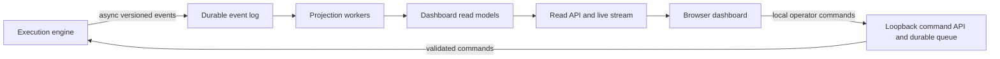

# Snipa Engineering Roadmap

This roadmap translates the target specification into staged, testable work.
No performance or profitability target is guaranteed. Production deployment
requires replay validation, paper trading, and tightly limited live capital.

## Personal-use completion profile

Snipa is designed for one operator's private use and is not intended for sale,
distribution, public access, or operation as a service. Completion therefore
targets one protected treasury, one low-balance live trading wallet, one execution
host, one reliable private RPC path, local or private-network dashboard access,
encrypted backups, and manual operator recovery.

Enterprise availability, public multi-user authorization, commercial operations
platforms, and specialized strategy-wallet fleets are explicitly outside the
completion definition. They are collected at the end under **MAY BE IMPLEMENTED
LATER, BUT NOT NECESSARY TO COMPLETE THE BOT**. This scope reduction does not
remove transaction validation, sellability and liquidity checks, position
reconciliation, spend and exposure limits, kill switches, secret protection,
realistic replay, or evidence-based live promotion.

## Current baseline

Implemented:

- PumpPortal new-token WebSocket monitoring with reconnect backoff.
- Local wallet loading, transaction signing, simulation, and confirmation checks.
- Paper mode, per-order and session budgets, SOL reserve, and mint deduplication.
- JSONL trade journal and wallet-independent history summary.
- Pre-signing enforcement of one configured signer/fee payer, resolved address
  lookup tables, explicit top-level program allowlisting, action-specific
  Pump/PumpSwap discriminators, requested mint, official base account roles,
  wrapped-SOL quote mint, argument lengths, aggregate buy-spend bounds, bounded
  Compute Budget settings, and deterministic wallet-owned ATA creation.
- Exact-content live arm file with repeated fail-closed checks and manual disarming.

Important limitations:

- Detection uses PumpPortal rather than direct validator account/transaction streams.
- Execution uses one RPC and PumpPortal-generated transactions.
- Top-level System and SPL Token instructions currently fail closed. State-aware
  WSOL funding/cleanup, token balance deltas, and Token-2022 extensions are not
  yet admitted.
- There is no complete token safety, liquidity, creator, wallet-cluster, scoring,
  sizing, position, exit, backtesting, Jito, or copy-trading engine yet. A narrow
  classic-SPL mint-authority preflight and read-only
  scanner dashboard foundation exists; the broader personal operations and command
  surfaces remain unimplemented. Optional multi-wallet and high-availability
  infrastructure is listed at the end.

## Strategy portfolio

The primary live strategy target is a filtered graduation/confirmation system;
first-slot and early-confirmation modes remain paper-only or experimental until
their independent evidence supports promotion:

| Mode | Recommended initial status |
| --- | --- |
| First-slot sniper | Paper-only |
| Early confirmation | Experimental, limited capital |
| Graduation sniper | Primary live strategy |
| Post-migration momentum | Secondary live strategy |

All statuses are deployment defaults, not claims of safety or profitability.
Each mode must retain independent features, thresholds, reports, and promotion
gates. The launch portfolio will:

1. Detect new Pump, PumpSwap, Raydium, and Meteora launches.
2. Reject unsafe, unsellable, illiquid, or coordinated launches.
3. Require a configurable amount of independent buyer-flow evidence.
4. Enter only when momentum, confidence, and fee-adjusted expected value pass
   strategy-specific thresholds.
5. Exit through deterministic stops, staged profit-taking, and live liquidity,
   creator, and wallet-flow monitoring.

A separate copy-trading engine may reproduce eligible post-observation source
wallet trades only after normal safety, freshness, exposure, and signing policy.
It must never copy private order flow, front-run a source, or bypass portfolio
limits because several followed wallets select the same token.

Two later engines extend the same infrastructure without weakening launch-trading
controls:

- Cross-pool arbitrage compares executable prices across PumpSwap, Raydium,
  Meteora, and approved aggregators, then submits both legs atomically only when
  conservative net profit remains above its threshold.
- Post-state backrunning reacts only after a large swap or liquidity event creates
  a verifiable price discrepancy. It must never place transactions on both sides
  of another user's trade or deliberately worsen that user's execution.

All engines share versioned event streams, venue decoders, wallet intelligence,
execution adapters, and observability. Each engine retains independent entry
models, capital and position limits, profit accounting, fee budgets, reports,
feature flags, and kill switches. Small-wallet deployments prioritize launch and
momentum strategies; arbitrage and backrunning remain disabled until capital,
infrastructure, and validation gates are met.

## Dashboard control-plane requirement

The final product includes a first-class interactive token scanner and operations
dashboard. It is a read-mostly control plane, not part of the low-latency trading
path. Every detected token must enter the event log before filtering so the UI can
show candidates that are scanning, qualified, rejected, monitored, skipped, or
entered instead of silently omitting them.

- Execution publishes bounded asynchronous telemetry and never calls browser
  sessions, chart services, or dashboard databases synchronously.
- Durable audit records remain authoritative; dashboard projections are
  rebuildable, versioned, disposable read models.
- A slow projection, expensive chart, disconnected browser, or unavailable
  dashboard service must not delay, pause, or terminate detection, risk checks,
  exits, transaction construction, or submission.
- Control commands use a separate loopback-only, single-operator, idempotent, and
  audited channel protected by origin/CSRF checks and recent live arming. The
  engine remains authoritative and may reject any command that violates signing,
  liquidity, exposure, reserve, or circuit-breaker policy.
- Browser clients never receive wallet secrets, signing material, provider
  credentials, private intelligence inputs, or unrestricted RPC access.

## Phase 1: Signing boundary and immutable decisions

- [x] Decode and allowlist action-specific Pump and PumpSwap instruction discriminators.
- [x] Verify expected mint, wallet account roles, writable accounts, and value bounds.
- [x] Reject unexpected Token-2022 use and unknown extensions.
- [x] Reject live sells before remote route construction unless authoritative
  bytes decode as classic 165-byte SPL Token accounts with the expected program,
  layout, option tags, mint, wallet owner, state, and sufficient raw balance.
  Numeric exits decode classic mint decimals without requiring revoked authorities;
  Token-2022 exits remain unsupported.
- [x] Decode every pinned Pump/PumpSwap sell amount and minimum-output argument,
  reject zero amounts or zero minimum output, cap aggregate raw token sales at the
  locally derived request amount, and journal that cap. A caller-trusted quote
  floor remains required before live strategy exits are complete.
- [x] Record candidate, rejection reason, decision inputs, latency timestamps, route,
  expected output, fees, simulation, submission, and final status in an append-only log.
- [x] Fail closed before broadcast when a live buy cannot durably append its
  candidate, policy approval, or simulation result. Keep sell exits available
  during journal failure, and never interrupt confirmation handling because a
  post-submission audit append failed.

Exit criteria: no remote response can make the wallet sign an unknown instruction,
program, signer set, mint, or spend above configured bounds.

## Phase 2: Direct detection and versioned decoders

Implemented foundation:

- [x] Decode PumpPortal `create` messages with the pinned
  `pumpportal-launch-v1` decoder into deterministic versioned launch events.
- [x] Validate mint, actor, and 64-byte transaction signatures before events
  reach strategy filters.
- [x] Suppress duplicate canonical transaction events across reconnects with a
  bounded in-memory identity cache.
- [x] Fail closed after an established PumpPortal socket disconnects when no
  bounded backfill is available: continue recording detections, reject automatic
  entry for the process lifetime, and replay exact connected, disconnected, and
  compromised stream-health state to the dashboard.
- [x] Define versioned per-venue reserve snapshots with raw reserves, slot, write
  version, source, and observation time; reject stale, future, zero-liquidity,
  pair-inconsistent, slot-divergent, duplicate, and regressive fixtures.
- [x] Store source-specific pool snapshots with bounded retention and require
  explicit source selection or multi-provider convergence within configured slot
  and reserve-divergence limits before exposing state.
- [x] Pin the tested Pump and PumpSwap reserve snapshot contract versions to their
  venues and reject unknown versions, cross-venue labels, and unimplemented venue
  decoder claims before validation or storage. Live ingestion remains disabled
  until the corresponding on-chain decoders exist.

- Add private RPC WebSocket account/log subscriptions from one reliable provider
  with reconnect, gap detection, bounded backfill, and explicit stale state.
- Build version-pinned decoders for Pump, PumpSwap, Raydium CPMM/CLMM/LaunchLab,
  and Meteora DLMM/DAMM/Dynamic Bonding Curve.
- Add version-pinned Pump.fun Mayhem Mode program decoding; identify Mayhem at
  creation, official agent wallets and programs, additional supply, agent trades,
  and net agent selling. Exclude agent volume from organic buyer-flow features.
- Default Mayhem candidates to live rejection until a separate Mayhem model,
  thresholds, replay dataset, calibration, and performance report are validated.
- Reject unknown program IDs and decoder versions.
- Track source-to-decision latency and stream divergence by provider.
- Normalize swaps, liquidity changes, pool creation, migration, and reserve
  updates into a versioned event model shared by all strategy engines.
- Add per-venue reserve snapshots with slot, write version, source, and freshness
  metadata so opportunities can reject stale or internally inconsistent state.
- Record complete bonding-curve and migration histories so later decisions can
  reproduce who accumulated supply, when migration occurred, and the post-migration
  state without look-ahead data.

Exit criteria: recorded slot-level fixtures deterministically produce identical
events, reconnect/backfill does not duplicate decisions, gaps fail closed, Mayhem
fixtures classify agent activity and supply correctly, and complete curve/migration
histories replay without state learned after the event timestamp.

## Phase 3: Guarded execution and adaptive fees

- [x] Give current live trade intents a configured wall-clock expiry measured
  from immutable candidate creation, enforced before route request, signing, and
  broadcast, and preserved in the decision log. Quote age, slot age, strategy-
  specific windows, and price-movement expiry remain outstanding.
- [x] Replay journal lifecycles by decision ID, persist the locally signed
  signature before RPC broadcast, and fence subsequent live buys while a signed
  submission remains unresolved. Reconcile signatures through RPC transaction
  history only at confirmed or finalized commitment; unknown, processed, RPC-
  failed, and journal-failed outcomes stay fenced. Exits stay available.
- [x] Serialize live buys through one process-wide FIFO gate across manual and
  monitored callers. Capture immutable candidate time before waiting so queue
  delay consumes intent lifetime, release the gate after every outcome, and let
  paper trades and sell exits bypass it.
- [x] Exclude concurrent live buys from separate local processes using the same
  journal through an atomic lock directory with owner metadata. Crash residue
  fails closed and requires explicit operator recovery; different journal paths
  and different hosts remain separate deployment domains.
- [x] Add idempotent order state around one normal RPC submission path: retries
  submit identical signed bytes under one signature, remote blockhash validity
  is checked at confirmed commitment before signing and again after simulation,
  and ambiguous outcomes remain fenced for history-backed reconciliation.
- [x] Replace each policy-approved remote transaction blockhash with a fresh
  confirmed RPC blockhash before local signing, journal its last valid block
  height, and use that exact validity window for confirmation.
- Add Jito protected submission where available and bounded normal-RPC fallback
  without duplicate positions or silent loss of required sandwich protection.
- Maintain blockhashes continuously for low-latency execution and use lookup
  tables only when beneficial.
- [x] Preserve policy-validated compute-unit limit, micro-lamport unit price, and
  worst-case priority fee in the journal; record simulation consumption and
  checked utilization basis points, rejecting missing or inconsistent live-buy
  reports while allowing sell exits to tolerate omitted optional metadata. Apply
  an optional operator-approved minimum live-buy headroom margin without assuming
  a default or restricting exits.
- Estimate compute units, sample writable-account priority fees, and cap fees by
  expected value using separate entry, routine-exit, and emergency-exit profiles.
- [x] Replay confirmed live journal records into submission-to-confirmation
  observation sample count, nearest-rank P50/P95/maximum, and invalid timestamp-
  pair count through the wallet-independent history command. Evaluate optional,
  operator-approved sample and P95 alert thresholds without assuming a default.
  This does not claim validator landing time.
- Measure submission-to-landing performance and alert when the configured provider
  no longer meets the approved personal-deployment thresholds.
- Add atomic multi-instruction route construction for two-leg arbitrage, including
  temporary token-account handling and multiple approved quote assets.
- Add Jito bundle construction for atomic arbitrage and strictly post-state
  backrunning, with bounded normal-RPC fallback only when atomicity is preserved.
- Require both legs, state assertions, fees, tips, slippage, rent, and cleanup to
  pass simulation or deterministic local execution modeling before submission.
- Reject an opportunity when either leg cannot execute atomically, its reserve
  snapshot is stale, or conservative net profit falls below the engine threshold.
- Integrate `jitodontfront` where transaction shape and Jito support permit it;
  verify account placement and address-lookup-table compatibility, report protected
  submissions separately, and detect fallback routes without equivalent protection.
  Reject the route or tighten slippage when protection required by policy is absent.
- Give every signal and economic order explicit expiry: maximum candidate age,
  decision-to-submission time, quote age, slots since qualification, and price
  movement. Cancel after the opportunity window, re-evaluate every retry, never
  escalate fees after edge expiry, and configure distinct launch, momentum,
  arbitrage, copy, and post-state windows.
- Precompute account layouts and instruction templates, cache venue constants,
  continuously refresh blockhashes and priority-fee estimates, and sign locally.
  Keep social, analytics, graph-remote, and dashboard calls off the execution path;
  permit deterministic local validation instead of mandatory remote simulation
  only for version-pinned configurations proven equivalent by fixtures.
- Benchmark the chosen local or VPS region against the configured RPC and Jito
  endpoints with synchronized clocks and drift alarms. Track P50/P90/P95/P99
  source-to-decision, decision-to-sign, sign-to-submit, and submit-to-land latency,
  and use locally cached graph/model inputs on the critical path. Initial objectives
  are decision-to-submission P50 below 15 ms and P95 below 35 ms, and decision-to-
  landing P50 below 350 ms and P95 below 800 ms; validate and revise them against
  current infrastructure rather than treating them as guarantees.

Exit criteria: controlled fault tests demonstrate one economic order despite
retries, provider failures, and ambiguous submission responses; multi-leg routes
either settle atomically or make no economic trade. Expired intent cannot submit,
every retry re-evaluates edge and protection, `jitodontfront` placement works with
resolved lookup tables, and the selected deployment meets currently approved SLOs.

## Phase 4: Deterministic token and liquidity safety

- [x] Before live buys, deterministically decode authoritative account bytes as
  the classic 82-byte SPL Token Mint layout; require valid authority option tags,
  initialized non-executable state, nonzero supply, and revoked mint/freeze
  authorities. Durably journal the accepted state and keep Token-2022/extensions
  fail-closed pending dedicated policies. Sell exits bypass this entry-only check.
- Identify the Token-2022 program owner explicitly and keep all Token-2022 mints
  ineligible for live buys. Add a dependency-safe, version-pinned decoder for base
  mint state and every supported extension; reject unknown extensions before
  considering any Token-2022 route eligible.
- Construct complete entry and exit routes locally and run sellability checks.
- [x] For pinned PumpSwap reserve snapshots, calculate fee-parameterized
  exact-input constant-product output and ceiling-rounded price impact in either
  direction with integer arithmetic; require an explicit inclusive maximum-impact
  ceiling, model post-trade reserves with a nondecreasing invariant, and bind the
  result to model, source event, pool, mint, slot, and policy identities for replay.
  Reject other venue semantics or unusable inputs. Runtime candidate gating
  remains disabled until trusted live reserve ingestion exists.
- [x] Define one atomic PumpSwap candidate-quote admission contract that requires
  fresh snapshots, exact pool and ordered-mint identity, an explicit selected
  source, inclusive impact enforcement, and an explicit convergence limit for
  multi-provider state. Keep it disconnected from runtime execution until trusted
  live reserve ingestion supplies authoritative snapshots and fee inputs.
- Derive and validate PumpSwap effective reserves and fees from authoritative
  accounts, and model Pump curves, Raydium pool variants, and Meteora bins
  independently.
- Enforce liquidity, concentration, price-impact, LP-control, holder, and
  coordinated-launch constraints before candidate scoring.
- Resolve holder entities using common funding, closely related funding slots,
  repeated bundle membership, identical transaction construction, shared address
  lookup tables, transfers, coordinated entry/exit timing, shared creator history,
  repeated co-participation, similar fee/tip patterns, and supply transfers around
  migration. Recalculate holder and top-N concentration by entity; raw wallet counts
  and raw top-10 concentration are diagnostic inputs, not final concentration.
- Build a separate time-series manipulation detector for structured sell-buy cycles,
  related-wallet price support, coordinated reversals, wash bursts, alternating
  trades, related wallets selling into normal buys or buying after normal traders
  realize losses, and artificial liquidity or price-floor maintenance.
- Calibrate manipulation probability independently from rug probability. Initial,
  configurable policy bands are below 0.30 potentially eligible, 0.30–0.50
  paper-only, above 0.50 rejected, and above 0.70 rejected plus cluster review.
- Continuously calculate fee- and slippage-adjusted executable prices across
  PumpSwap, Raydium, Meteora, and explicitly approved aggregator routes.
- Model quote-asset balances, associated accounts, transfer fees, and conversion
  costs so cross-pool comparisons use realizable wallet-level returns.
- [x] Define a PumpSwap simulation-agreement validator that rejects regressing or
  over-skewed slots, cross-pool, reversed-pair or direction mismatches, and ceiling
  basis-point divergence in effective input, output, or either modeled post-trade
  reserve. Compose it with candidate-quote admission so reserve checks always
  precede simulation agreement and both replay-bound results are returned together.
  Extract exact pool, ordered-mint, and base/quote vault identities from authorized
  PumpSwap transaction accounts and reject aliased identities. Request those exact
  vaults from live simulation, decode only initialized classic SPL Token account
  returns with matching mints, journal post-simulation raw balances, and reject
  missing or malformed returns before broadcast. After authorization, take one
  same-slot confirmed RPC point read of those exact vaults, decode and deduplicate
  their pre-trade reserves, reject conflicting same-pool identities, and durably
  journal the pinned snapshots before signing. Decode exact PumpSwap instruction
  semantics and both raw constraints for exact-output buys, exact-quote-input
  buys, and exact-base-input sells; reject zero output constraints and journal
  the decoded semantics with policy approval. Pin the official PumpSwap global
  config, fee config, and fee program PDAs in transaction policy. Decode the fee
  program's flat, market-cap-tiered, and stable-tier schedules, bind the response
  to the exact requested address, and journal it from the same confirmed RPC slot
  as the pre-trade reserves. Given a trusted snapshot, derive
  positive direction-aware input/output deltas, bind the selected reserve event,
  and apply quote/simulation agreement through one composed contract. Continuous
  or multi-provider reserve ingestion, authoritative dynamic tier-selection
  inputs, multi-component fee rounding, and runtime candidate-gate wiring remain
  outstanding.
- Verify that locally modeled post-trade reserves and token deltas match simulation
  within deterministic tolerances before enabling atomic strategies.

Exit criteria: fixture coverage includes adversarial mints, transfer behavior,
counterfeit pools, liquidity removal, asymmetric entry/exit outcomes, bundled and
related holders, manipulated time series, and entity-adjusted concentration that
cannot be diluted by splitting supply across linked wallets.

## Phase 5: Graduation strategies, intelligence, scoring, and abstention

- Build a time-versioned creator and wallet graph with probabilistic cluster edges.
- Make graduation sniping the initial primary live candidate: observe the complete
  bonding-curve history, reconstruct entity-adjusted concentration, score migration
  quality, detect rapid low-participation migrations, reject concentrated launch
  histories, and enter only after a qualified migration. Keep first-slot,
  early-confirmation, graduation, and post-migration reports distinct.
- Initial configurable full-size graduation requirements are at least 60 seconds
  of launch history, at least 100 entity-resolved holders, no excessive early-buyer
  concentration, no disqualifying manipulation pattern, and no excessive price
  movement after qualification. Validate each threshold against contemporaneous data.
- Maintain independent model families for Pump.fun regular, Pump.fun Mayhem,
  PumpSwap canonical, Raydium CPMM/CLMM/LaunchLab, and Meteora DLMM/DAMM/Dynamic
  Bonding Curve. Never apply a model across venues unless that cross-venue model
  has explicit validation.
- Evaluate ensembles of simpler tabular models such as XGBoost, Random Forest,
  LightGBM, and MLP while keeping per-family training data, feature distributions,
  calibration, thresholds, versions, drift monitoring, and reports separate.
- Produce separately calibrated rug probability, manipulation probability,
  conditional net-return estimate, and probability that the exact entry closes
  with positive net P&L. Do not combine or relabel these outputs.
- Train profitable-close classifiers at 90-second, 5-minute, 15-minute, and
  60-minute horizons. Labels include platform and priority fees, Jito tips, rent,
  entry/exit slippage, transfer fees, failures, actual exit capacity, partial exits,
  and emergency exits.
- Add minimum expected value/confidence, maximum uncertainty, hourly/daily limits,
  platform thresholds, and no-trade regimes.
- Detect calibration drift and tighten thresholds automatically; never loosen risk
  limits without explicit authorization.
- Add launch momentum features for independent buyer growth, buy/sell volume
  imbalance, price acceleration, liquidity change, and wallet-cluster independence.
- Add a dedicated arbitrage scanner that compares synchronized reserve snapshots,
  ranks atomic routes by conservative net profit, and abstains under stale or
  divergent state.
- Add a post-state opportunity engine for large swaps, migrations, and liquidity
  events. It must derive the expected state after the triggering transaction and
  admit only opportunities profitable in that post-state.
- Keep strategy scores and thresholds separate: launch quality, early momentum,
  cross-pool arbitrage, and post-state backrunning must not share an uncalibrated
  aggregate score.
- Compare calibrated ensemble outputs and abstain when disagreement exceeds its
  configured bound, inputs are outside training distribution, required feature
  groups are missing, or entity resolution is incomplete. Publish disagreement,
  missing inputs, and abstention reasons to audit and dashboard projections.
- Treat independent-wallet consensus only as a bounded signal after entity
  independence, timing, source reliability, and coordinated-bait checks. It may
  increase confidence but never multiply size beyond aggregate token exposure.
- Keep optional social signals off the critical path, low-weight, freshness-tagged,
  and resistant to duplicated or automated activity. Missing social data is
  unavailable, not negative, and social context cannot override deterministic safety.

Exit criteria: walk-forward calibration reports are reproducible and contain no
features learned after the historical decision timestamp; post-state strategies
use no state unavailable at their permitted ordering point. Venue/model routing,
Mayhem rejection, graduation-history minimums, multi-horizon labels, out-of-
distribution checks, and ensemble-disagreement abstention pass recorded fixtures.

## Phase 5A: Copy trading and source-wallet intelligence

- Monitor allowlisted source wallets in real time and decode purchases, partial
  sales, complete exits, transfers, and venue routes from public confirmed state.
- Reconstruct an equivalent bot-wallet transaction through approved local venue
  adapters. Support fixed-size, proportional, and capped-proportional sizing, with
  capped-proportional as the default; mirror source sales by percentage of the
  source position sold rather than copying raw token quantity.
- Pass every copy through normal token, liquidity, entity concentration,
  manipulation, sellability, freshness, slippage, portfolio, and signing gates.
  Skip excessive detection delay or post-source-fill price movement.
- Require paper-copy qualification before live copying and independent copy capital,
  loss, concurrency, expiry, and kill-switch limits. Deduplicate a token selected by
  multiple sources and enforce one global token/cluster exposure cap across sources.
- Qualify source wallets using realized net profit, profit factor, maximum drawdown,
  closed positions, holding period, copy-delay/slippage performance, creator/insider
  and launch relationships, related clusters, deposits/withdrawals, wash activity,
  profit concentration in exceptional tokens, and losses transferred away rather
  than sold. Displayed or unrealized profit is insufficient.
- Run historical copy simulation per source to answer what this bot would have
  earned under configured delay, safety filters, limits, slippage, fees, and
  exit-mirroring. Model source fill, observation and decision latency, subsequent
  movement, liquidity and likely bot fill, misses/rejections, partial exits,
  transfers, position capacity, and competition from other followers.
- Produce a calibrated copyability score from realizable copied outcomes rather
  than ranking wallets by source profit alone. Preserve each copied/skipped decision
  and its exact reasons.

Exit criteria: source-led fixtures deterministically reconstruct positions and
partial exits, delayed-copy replay reconciles every cost and skip, related sources
cannot multiply token exposure, and live copying remains disabled until a source
passes paper-copy and statistically defined promotion gates.

## Phase 6: Risk sizing and exits

- Size from maximum planned loss, wallet equity, liquidity, exit depth, fees,
  slippage, creator uncertainty, and correlated wallet-cluster exposure.
- Add hard/time/trailing/liquidity/creator/flow/state-change/holding-period exits,
  partial profit-taking, and portfolio emergency liquidation.
- Construct exits locally and retain fee reserves; prohibit martingale behavior.
- Allocate independent capital, inventory, quote-asset exposure, fee reserves,
  daily loss limits, and concurrency limits to each strategy engine.
- Require arbitrage sizing to remain within executable depth on both legs and cap
  exposure if atomic settlement or account cleanup cannot be guaranteed.
- Default arbitrage and backrunning to disabled for small-wallet profiles; enable
  them only after minimum-capital, provider-quality, and observed-net-profit gates.
- Require one protected treasury and one low-balance live trading wallet. The bot
  cannot sign from treasury, and strategy allocations are accounting boundaries
  within the live wallet rather than separate hot wallets.
- Put one authoritative global risk engine above every strategy and owned balance.
  It reconciles combined equity, drawdown, deployed capital, same-token and related
  creator-cluster exposure, copied-source overlap, quote exposure, daily loss,
  emergency SOL, duplicate pending transactions, correlated strategy exposure,
  and aggregate realized/unrealized P&L. Strategy limits may only tighten global
  limits, never expand them.
- Permit automated transfers only as one-way reconciled sweeps from hot wallets to
  one allowlisted treasury destination. Require manual authorization for funding
  increases, amount ceilings, multi-step withdrawal-address changes, pre/post-sweep
  reconciliation, minimum emergency balances, and stranded-token-account recovery.
- Define immutable capital-tier profiles for $30–$200, $200–$1,000,
  $1,000–$10,000, $10,000–$100,000, $100,000–$500,000, and $500,000–$1 million.
  Each specifies maximum risk/trade, position and total exposure, enabled strategies,
  daily loss, treasury percentage, required performance history, liquidity, and
  exit capacity. Personal-use completion retains one live wallet at every tier;
  risk percentages decrease as capital grows.
- Track a combined-wallet high-water mark and protected-profit sweeps. Do not draw
  principal from reserves during drawdown; reduce size after a configurable 5–8%
  drawdown and default to paper mode near 12%. Keep trading, emergency,
  infrastructure, and tax reserves separate; restoring reserves to trading requires
  explicit authorization.
- When combined active and protected capital reaches the configured terminal goal
  (initially $1 million), disable new entries, close positions subject to liquidity,
  reconcile all wallets/transactions, sweep eligible funds to protected custody,
  and emit a final performance/disposition report. Live resumption requires manual
  authorization and normal arming; continuous operation never overrides this stop.
- Maintain a tax/disposition ledger with acquisition time and cost basis,
  disposition time and proceeds, crypto-to-crypto records, attributable fees, CAD
  fair-market value at transaction time, internal-transfer classification, and
  on-chain reconciliation across strategy and treasury wallets. Export realized
  business-income records while leaving Canadian tax classification accountant-reviewed.

Exit criteria: every admitted entry has a locally constructible bounded-loss exit
plan and deterministic trigger precedence before submission; atomic strategies
cannot strand unintended directional inventory in tested failure modes; aggregate
wallet state cannot exceed any global exposure, loss, reserve, or goal-state limit.

## Phase 7: Replay, shadow deployment, and observability

- Implement slot-level replay with contemporaneous state, ordering, fees, failed
  transactions, exit capacity, and temporal feature snapshots.
- Add temporal splits, walk-forward tests, regime reports, then paper and limited
  shadow deployment before production capital.
- Report decisions, rejection reasons, latency, failures, slippage, fees, P&L,
  excursions, exits, drawdown, confidence intervals, calibration, and provider health.
- Encrypt sensitive intelligence logs and document wallet drain/key rotation.
- Replay synchronized multi-pool state and triggering transactions to measure
  arbitrage opportunity half-life, stale-state rejection, atomic landing rate,
  realized net profit, and adverse inventory outcomes.
- Produce separate shadow and production reports for launch sniping, momentum,
  arbitrage, and backrunning; prohibit one engine's gains from masking another
  engine's losses or policy violations.
- Add independent strategy kill-switch drills and a global stop that prevents new
  submissions while preserving safe reconciliation of ambiguous transactions.
- Publish versioned dashboard projection events asynchronously for every candidate,
  stage transition, finding, score, decision, position, trade, provider-health
  update, and risk-control transition.
- Build replayable read models for token status, positions, performance, wallet
  intelligence, provider health, and risk state; expose projection lag, dropped
  non-audit telemetry, and last successful update rather than displaying stale
  data as current.
- Replay copy strategies separately with actual source fills, observable time,
  decision delay, follower competition, likely bot fills, source transfers,
  partial exits, capacity constraints, and all copied/skipped outcomes.
- Define a win as one completely closed economic position with positive net P&L
  after every attributable cost. Failed entries remain execution failures;
  unsellable tokens receive an outcome; partial exits do not create extra wins;
  transfers and unrealized positions are not profit; gross pre-fee profit is not
  a win; and abandoned dust receives a documented loss treatment.
- Require at least 500 fully closed live or tightly limited production trades
  before claiming a 60% win rate. Report Wilson 95% confidence intervals by
  strategy and venue, profit factor, average winner/loser, maximum drawdown,
  expected calibration error, Brier score, AUCPRC and MCC for imbalanced labels,
  market regime, score and liquidity bands, and profit concentration in the
  largest trade and largest creator/source cluster. Rejected candidates do not
  count as closed trades.
- Require both the win-rate gate and positive after-cost expectancy:

  $$
  P(\mathrm{win})\,\overline{W}
  > P(\mathrm{loss})\,\overline{L} + C
  $$

  where $\overline{W}$ and $\overline{L}$ are average gross winning and losing
  magnitudes and $C$ is every attributable cost over the same basis. The reported
  win definition and accounting remain net of those costs. Require profit factor
  at least 1.3 for initial promotion and 1.4 before scaling, reject exits selected
  only to inflate win rate, and stress worse-than-modeled stop execution.
- Version feature definitions and immutable labels; retain reproducible feature
  snapshots, training manifests, calibration artifacts, and a local model registry.
  Support champion/challenger and shadow inference, automated retraining proposals,
  per-venue retirement, deterministic inference replay, and automatic rollback on
  degradation. Any promotion that loosens risk requires manual authorization.

Exit criteria: at least 1,000 realistically replayed or limited live observations
for pipeline validation and, separately, 500 fully closed production-limited trades
for any 60% claim, with independently reviewable logs, no look-ahead leakage,
positive expectancy, required profit factor, and confidence/calibration reports.

## Phase 7A: Personal operations, recovery, and production security

- Run one supervised execution process with automatic restart, an exclusive
  single-instance lease, startup order/position reconciliation, and refusal to
  submit while another live instance may own the wallet.
- Define personal recovery-point and recovery-time objectives; maintain encrypted
  off-device state backups and tested restores. Reconstruct open positions after
  local database loss from the ledger, append-only audit records, and on-chain
  state; test corrupted-event-log recovery, emergency signer rotation, and provider
  credential rotation.
- Use maintenance deployments that block new entries and refuse deployment while
  orders are unreconciled. Preserve scanning, reconciliation, position monitoring,
  and emergency exits during safety pauses; keep known-good decoder/model artifacts
  available for manual rollback.
- Keep the live key in an encrypted local signer boundary and keep treasury signing
  unavailable to the trading process. Never place plaintext seed phrases in config
  or logs; enforce spend policy, signer rate limits, treasury-destination allowlists,
  key rotation and compromise containment, and separate development/paper and live
  keys.
- Pin dependencies and verify the lockfile; run locally available vulnerability,
  secret, and static-analysis checks. Require manual review for dependency changes
  affecting cryptography, signing, or transaction construction.

Exit criteria: duplicate-process, restart, restore, corrupted-log, signer-rotation,
and rollback drills preserve exactly-one order semantics and reconciled positions;
the live process cannot sign treasury transfers or exceed local signer policy.

## Phase 8: Interactive token scanner and operations dashboard

The dashboard may be developed against replay and paper-mode projections earlier,
but live controls remain disabled until their Phase 2 through Phase 7A data, risk,
execution, audit, recovery, and security dependencies pass their own exit
criteria.

Implemented foundation:

- [x] Publish unique decoded token detections before strategy filtering through a
  bounded, sequential, asynchronous JSONL projection sink.
- [x] Contain sink and diagnostic failures and expose queue depth, in-flight state,
  accepted, published, dropped, failed, oldest-event age, and last-publish health.
- [x] Replay token detections and status changes into an idempotent scanner read
  model that preserves exact reasons and rejects malformed, unknown-token,
  mint-mismatched, time/stage-regressive, and terminal-rewrite events.
- [x] Publish monitoring, skipped, entered, and rejected outcomes from the current
  monitor with complete filter, session-limit, and execution-error reasons.
- [x] Expose loopback-only, read-only scanner and replay-health HTTP endpoints
  backed solely by projection-log replay, with bounded queries, no-store security
  headers, explicit missing/degraded state, and no wallet or command dependency.
- [x] Serve a responsive read-only Live Scanner with projection health, real-data
  status visualization, token counts, search, status filters, deterministic
  sorting, locally persisted pins, stable polling, explicit unavailable
  analytics, exact reasons, API-owned event freshness and stale labeling, and a
  token detail drawer with an immutable accepted-event decision timeline.
- [x] Record one local observation-to-decision latency sample per token, preserve
  it through replay, expose sample count/P50/P95/maximum through scanner health,
  and label it separately from unavailable source, network, validator, and landing
  latency.

### Live scanner

The scanner shows every detected token in real time and supports stable sorting,
filtering, pinning, and search without changing engine decisions. Its primary grid
contains:

| Column | Required value |
| --- | --- |
| Token | Symbol, name, and mint |
| Age | Time since first detection, such as `2.4 seconds` |
| Venue | Pump, PumpSwap, Raydium variant, or Meteora variant |
| Stage | Current analysis stage |
| Status | Scanning, qualified, rejected, monitoring, skipped, entered, or exited |
| Safety | Calibrated score from 0 to 100 |
| Rug probability | Calibrated probability with model version |
| Momentum | Strategy-specific score from 0 to 100 |
| Expected net return | Conditional return after all modeled costs |
| Buyers | Unique buyer count and linked-buyer count |
| Creator history | Prior launches, outcomes, and linked-wallet history summary |
| Creator holding | Current creator-controlled supply percentage |
| Holder concentration | Top-holder and configurable top-N supply concentration |
| Cluster concentration | Supply controlled by related-wallet clusters |
| Volume | Executed buy volume and sell volume over a labeled window |
| Buy/sell ratio | Executed buy volume divided by sell volume over a labeled window |
| Price change | Executable price change over a labeled window |
| Liquidity | Current executable entry and exit liquidity, not reported TVL alone |
| Price impact | Estimated entry and planned-exit impact at proposed size |
| Token controls | Mint/freeze authority state and Token-2022 extension risk flags |
| Decision | Exact rejection reasons or current entry/monitoring outcome |

Safety, rug, momentum, and return values must show unavailable when their required
inputs are missing or stale. They must never substitute zero, reuse a score from a
different strategy, or present an uncalibrated value as a probability.

Selecting a token opens a detail workspace containing:

- Live executable-price and volume charts with source and freshness indicators.
- Buyer-arrival timeline with unique and linked-wallet classification.
- Holder-distribution and concentration charts.
- Creator funding graph and related-wallet clusters with evidence timestamps.
- Recent decoded swaps and transfers, plus liquidity changes by venue.
- Mint authorities, freeze authorities, Token-2022 extensions, and security findings.
- Versioned model explanation, missing inputs, uncertainty, and threshold results.
- Projected entry and exit values including price impact, slippage, fees, rent,
  tips, transfer fees, and confidence bounds.
- Complete immutable decision timeline from detection through final outcome.

### Dashboard sections

1. **Live Scanner** shows every token and its current processing stage.
2. **Qualified Opportunities** shows candidates satisfying most or all entry
   conditions while preserving unmet rules and uncertainty.
3. **Rejected Tokens** shows every failed rule, input value, threshold, model or
   decoder version, and decision timestamp.
4. **Open Positions** shows entry cost basis, current executable exit value,
   unrealized net profit, stop state, targets, liquidity, and exit capacity.
5. **Trade History** shows gross proceeds, cost basis, network and priority fees,
   tips, rent, transfer fees, slippage, price impact, and final net profit.
6. **Wallet Intelligence** visualizes creator funding, linked buyers, clusters,
   historical launches, prior outcomes, and confidence in each relationship.
7. **Bot Health** shows RPC and stream latency, gaps, divergence, reconnects,
   Jito availability, submission and landing rates, projection lag, and wallet reserve.
8. **Risk Controls** shows equity, drawdown, daily realized loss, current and
   correlated exposure, fee reserves, open-order state, and circuit breakers.
9. **Copy Trading** ranks sources by realized net return, win rate, profit factor,
   drawdown, closed positions, holding time, copy delay, simulated copied return,
   copyability, related-wallet risk, and creator/insider warnings. It shows follow,
   paper/live-copy state, source limits and kill switches, and exact copy/skip reasons.
10. **Wallet and Treasury** shows live-wallet and treasury balances and reserves,
    strategy allocation, combined exposure, pending transfers and sweeps, emergency
    SOL, reconciliation, global versus strategy limits, and terminal-goal progress.
11. **Model Health** shows active model/calibration versions, training period,
    input and calibration drift, Brier score, expected calibration error, ensemble
    disagreement, out-of-distribution frequency, probability-band win rates,
    champion/challenger results, and automatic threshold-tightening events.

### Interactive controls

The dashboard supports these commands through the isolated command API:

- Pause or resume new entries without disabling position monitoring or safe exits.
- Request emergency liquidation of all positions, with per-position results and
  explicit failures when a safe executable exit cannot be built.
- Switch to paper trading; returning to live mode requires the normal live-arm
  controls and cannot be accomplished by a stale browser session alone.
- Select defensive, balanced, or aggressive presets within immutable server-side
  risk ceilings, and tighten individual risk settings.
- Block a token, wallet, or creator with scope, reason, author, and expiry.
- Manually approve a qualified trade without bypassing deterministic safety,
  sizing, freshness, simulation, budget, or signing policy.
- Close one position subject to the same exit construction and safety checks.
- Export versioned decision, trade, and performance records.
- Inspect why any trade was accepted, rejected, skipped, entered, or exited.
- Inspect source-wallet qualification, historical copy simulation, entity-cluster
  evidence, model disagreement, and why a source trade was copied or skipped.

Sensitive or loss-increasing controls require loopback origin and CSRF protection,
recent live arming, rate limits, explicit confirmation of the effective change,
and an append-only audit event. Commands carry unique IDs and expire; retries must
not create duplicate economic actions. The UI must display accepted, rejected,
expired, and still-pending command states without claiming success early.

Exit criteria:

- Recorded fixtures and paper sessions render every detected token and reproduce
  exact engine stages, inputs, scores, findings, decisions, and rejection reasons.
- Position and trade views reconcile to authoritative ledger and journal records,
  including every modeled and realized cost and final net profit.
- Copy, treasury, and model-health views reconcile to their authoritative
  read models and show unavailable or stale rather than inferred values.
- Disconnect, reconnect, slow-client, projection-rebuild, and dashboard-outage
  tests demonstrate no measurable change to engine decision or submission latency
  beyond the explicitly budgeted asynchronous publication overhead.
- Local-control tests prove browser clients cannot retrieve signing material,
  loosen hard server limits, bypass live arming, origin/CSRF checks, or transaction
  policy, replay an expired command, or cause duplicate orders.
- Accessibility, responsive layout, large-token-set performance, stream backpressure,
  stale-data labeling, and complete audit reconstruction pass release tests.
- Dashboard controls cannot transfer funds from treasury automatically, weaken
  global limits, promote a risk-loosening model, defeat the single-instance lease,
  or resume live operation after the terminal capital goal without explicit arming.

## Phase 8A: Creator launch visibility and post-bond liquidity management

This creator-facing engine is separate from Snipa's trading strategies and is not
required to complete the personal trading bot. Its purpose is to help one operator
launch transparently, measure authentic reach, and maintain reasonable post-bond
market quality. It must never manufacture volume, holders, comments, rankings, or
demand through self-trading, coordinated wallets, wash activity, deceptive
promotion, or undisclosed treasury actions. No feature or budget can guarantee
Pump.fun discovery, bonding, migration, price performance, or project success.

### Launch success priorities

A liquidity-management engine is helpful after bonding but is not crucial to the
initial success of a new coin. Initial launch work should prioritize:

1. A compelling concept and recognizable presentation.
2. Authentic distribution and an active community.
3. Transparent creator behavior and restrained, disclosed creator holdings.
4. Sustained real buyers, holder retention, and consistent communication.
5. Enough natural post-bond liquidity for reasonable entry and exit execution.

The engine becomes useful after genuine trading exists. It can monitor liquidity,
warn about excessive price impact, recommend or manage disclosed treasury
liquidity, and measure market quality. It cannot create genuine demand, repair weak
branding, substitute for community work, or safely manufacture visibility.

For a limited launch budget, use these planning bands rather than guarantees:

| Purpose | Suggested share |
| --- | ---: |
| Content, community, creative assets, and authentic distribution | 50–70% |
| Transparent liquidity reserves | 20–40% |
| Infrastructure and monitoring | 5–10% |

### Creator campaign and visibility workflow

- Maintain a campaign lifecycle from draft, scheduled, launched, bonding, bonded
  or migrated, through sustained operation, with immutable milestone timestamps.
- Validate coin name, ticker, image or video, description, website, social links,
  mint address, and official pool links before publication.
- Publish creator and treasury disclosures, supply allocation, authority state,
  creator-controlled holdings, liquidity policy, and material wallet movements.
- Provide a launch checklist, content calendar, reusable media kit, campaign-link
  attribution, and coordinated publication to operator-approved social channels.
- Track impressions, page visits, community joins, unique holders, retained-holder
  cohorts, organic buyer growth, bonding progress, and attributable conversions.
- Monitor Pump.fun community replies, moderation state, impersonation, scam links,
  social mention velocity, and sentiment without treating automated activity as
  authentic engagement.
- Permit community participation campaigns based on content or contribution, but
  never require purchases or reward artificial trading, coordinated buying, or
  misleading promotion.
- After bonding, detect and independently verify the canonical migrated pool and
  publish verified mint and pool links. Track legitimate profile or listing
  applications only after their current eligibility requirements are met.

### Liquidity-management scope

- Begin with read-only liquidity, depth, spread, price-impact, treasury inventory,
  fee, and impermanent-loss monitoring plus manual recommendations.
- Measure whether representative entry and exit sizes can execute within approved
  impact limits; show unavailable rather than infer depth from reported TVL alone.
- Recommend or add balanced liquidity when executable trading becomes too thin,
  and remove or rebalance liquidity cautiously when treasury or inventory exposure
  becomes excessive, always within explicit capital and loss budgets.
- Where a supported venue has a traditional order book, optionally place genuine,
  funded buy and sell quotes subject to inventory, spread, cancellation, and
  self-trade controls. Quotes must be intended to execute and must not spoof demand.
- Model balanced liquidity additions at the pool's current ratio and disclose both
  assets, source wallet, transaction, purpose, and applicable lock or withdrawal
  policy.
- Add or remove liquidity automatically only after venue-specific account and
  instruction decoders, simulation agreement, position reconciliation, capital
  limits, and operator-approved policies pass replay and paper tests.
- Cap total deployed liquidity, SOL reserve, rebalance frequency, daily/monthly
  loss, transaction count and value, per-wallet and aggregate exposure,
  adverse-selection exposure, impermanent loss, and transaction/priority fees.
  Preserve a manual kill switch and safe reconciliation after ambiguous submissions.
- Track fees earned, treasury value, inventory composition, realized and
  unrealized loss, impermanent loss, token depreciation, and each rebalance's
  after-cost result.
- Label treasury and liquidity wallets publicly where appropriate and retain an
  append-only audit trail for every recommendation, approval, transaction, and
  position change.
- Enforce self-trade prevention and related-wallet exclusion. Liquidity actions
  target market quality, not volume, ranking, price support, or visibility metrics.

For example, if selling $100 would move the executable price by 18%, the engine
could recommend or add balanced coin/SOL liquidity from a disclosed treasury so a
comparable sale has lower modeled price impact. It must not repeatedly buy and sell
the coin, directly or through related wallets, to fabricate activity.

On PumpSwap, which is an automated market maker rather than a traditional order
book, this primarily means automated LP-position and treasury management; it does
not mean placing bid and ask orders. Its purpose is post-bond market quality and
stability, not Pump.fun visibility rankings.

### Staged adoption

1. Launch with monitoring, alerts, disclosure, and manual recommendations only.
2. After bonding and sustained organic activity, permit manually approved balanced
   liquidity changes within hard budgets.
3. Consider automatic LP rebalancing only after enough observed operations prove
   venue decoding, accounting, simulation, and loss controls reliable.
4. Revert to recommendation-only mode under stale data, abnormal volatility,
  RPC uncertainty, suspicious activity, reconciliation uncertainty, or budget
  breach.

Simple monitoring and manual recommendations are the cheapest and preferred
starting point. Automatic LP rebalancing costs more because it creates additional
transactions, adverse-selection exposure, impermanent loss, and operational
complexity. On Solana, ordinary transaction fees are usually not the dominant
expense; deployed capital and market exposure are.

### Planning costs and capital risk

The engine software can run cheaply. The primary expense and risk are the assets
committed to liquidity, not compute. These are rough planning ranges and must be
rechecked against current providers, SOL prices, congestion, venue rules, and the
operator's maximum affordable loss:

| Cost | Typical planning range |
| --- | ---: |
| VPS | $5–30/month |
| RPC provider | $0–100/month initially |
| Monitoring and data services | $0–100/month |
| Ordinary Solana transaction fees | Usually cents to a few dollars/month |
| Priority fees during congestion | Variable |
| Liquidity capital | Roughly $500–$10,000+ |
| Impermanent loss or token depreciation | Potentially most or all committed capital |

For example, a $2,000 balanced liquidity addition generally requires approximately
$1,000 of the coin and $1,000 of SOL at the pool's current ratio. The LP position
remains controlled according to the venue and position policy, but its composition
changes as users trade; its withdrawal value is not guaranteed to remain $2,000.

A small-launch planning budget may begin with:

| Budget item | Example range |
| --- | ---: |
| Infrastructure | $10–50/month |
| Initial balanced liquidity | $500–$2,000 |
| SOL transaction reserve | $20–$50 |
| Explicit maximum monthly loss budget | $100–$500 |

All figures are configurable ceilings, not spending targets. Funding increases,
loss-limit increases, treasury withdrawals, and automation promotion require
explicit operator authorization. The operator must assume that liquidity capital
and the monthly loss budget can be lost in full.

Exit criteria: replay and paper fixtures reconcile every liquidity recommendation,
approval, LP position, asset delta, fee, and loss; automatic actions cannot exceed
capital or loss limits, trade with an operator-related wallet, target volume or
ranking, hide treasury activity, or proceed with stale, divergent, or unresolved
state. Creator analytics distinguish observed organic activity from unavailable or
suspected automated activity and make no success guarantee.

## MAY BE IMPLEMENTED LATER, BUT NOT NECESSARY TO COMPLETE THE BOT

The following capabilities may improve latency, uptime, convenience, or operational
assurance, but they are not required for the personal-use completion definition and
must not block a release that passes the required phase exit criteria. They become
mandatory only if Snipa is redesigned for public access, multiple operators,
managed customer funds, or a formal availability commitment.

### Premium and redundant data infrastructure

- A second private RPC provider with automated submission and stream failover.
- Managed Yellowstone gRPC feeds, Jito ShredStream, or other premium low-latency
  data contracts.
- Commercial archival/indexed Solana datasets when locally collected or lower-cost
  historical records are sufficient for the required replay evidence.
- Multi-region provider benchmarking and automatic regional routing. The required
  personal deployment still measures its own end-to-end latency and fails closed
  when data is stale or incomplete.

### High availability and uninterrupted deployment

- Two execution hosts in separate regions, active/hot-standby operation, replicated
  databases, distributed leader election and fencing, split-brain prevention,
  automatic takeover, and region-failure drills.
- Standby-first rolling deployments, zero-interruption scanner upgrades, automated
  paper-order canaries, and fully automated rollback orchestration.
- A dedicated High Availability dashboard for replication lag, leader leases,
  failover history, split-brain alarms, regional readiness, and deployment state.
- Continuous 24/7 cloud hosting. A supervised personal VPS may be adopted for
  convenience, but local or manually operated hosting can complete the bot.

### Public and multi-user product controls

- Internet-facing dashboard hosting, public APIs, tenant isolation, user accounts,
  role-based access control, delegated permissions, and multi-user audit attribution.
- Production reverse-proxy infrastructure, public TLS certificates, identity-provider
  integration, and customer-facing availability or support systems.
- Public distribution packaging, installers, hosted onboarding, billing, usage
  metering, and service-level commitments.

Loopback origin/CSRF protection, live arming, command expiry, rate limits, and audit
records remain required because malicious local web content can target localhost.

### Managed commercial operations and security services

- A managed high-availability PostgreSQL cluster; the personal bot may use local
  durable state plus encrypted, tested off-device backups.
- Commercial monitoring, paging, log aggregation, model-registry hosting, artifact
  storage, or backup platforms when local/open-source equivalents are adequate.
- Cloud HSM/KMS or a commercial isolated signer. The personal bot still requires an
  encrypted local signer boundary, a separate inaccessible treasury, spend policy,
  destination allowlists, and key-rotation recovery.
- Paid software-composition analysis, hosted SBOM management, signed production
  builds, deployment-image scanning, and a professional external security audit.
  Lockfile verification, dependency review, secret scanning, and locally available
  vulnerability/static checks remain required.

### Specialized wallet and optional signal expansion

- Separate launch, copy, arbitrage, post-state/backrunning, emergency, and recovery
  hot wallets. Personal completion uses one low-balance live wallet plus one
  protected treasury and enforces strategy allocations in the global risk engine.
- Paid social-data APIs and social models. Social context remains optional,
  low-weight, off the critical path, and unable to override deterministic safety.
- Premium Jito/searcher arrangements beyond the protected submission methods
  available to the personal deployment. The bot must still reject or reduce risk
  when required transaction protection is unavailable.
- The Phase 8A creator campaign and post-bond liquidity-management engine,
  including paid distribution tooling, profile/listing workflow automation,
  premium social analytics, and automatic LP rebalancing. Monitoring and manual
  recommendations should precede any automatic capital action.

## Explicit exclusions

Sandwich attacks, deceptive volume, coordinated manipulation, private-order
exploitation, and bypassing platform protections are out of scope. Backrunning
must be non-victimizing: no transaction may be placed before and after the same
user trade, target a user for adverse execution, or depend on concealing intent.
Submission paths should use private routing or other sandwich protection where
available for the bot's own transactions.